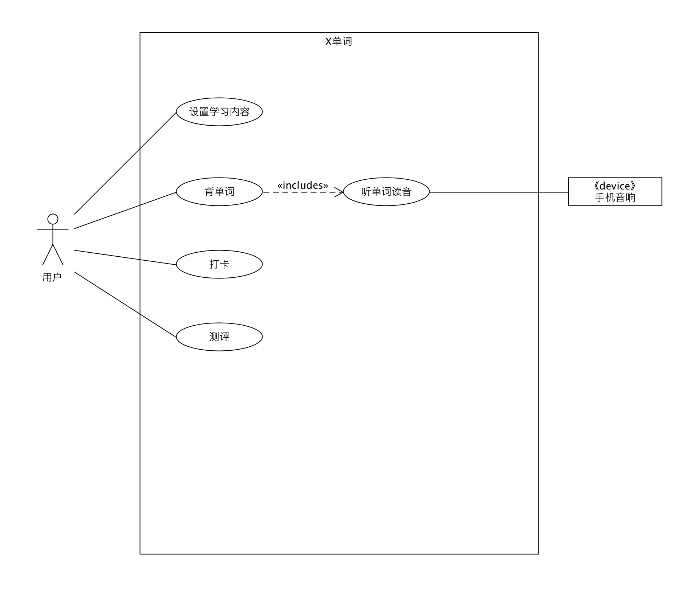

# rush B

## Use Case Diagram

用例图(Use Case Diagram)

1. x单词
2. 用户和用例连线无箭头实线
3. 《includes》虚线
4. 外部设备注意《device》《system》《api》
5. 动名词用例

##  Activity Diagram

活动图(Activity Diagram)

1. 要有开始点和结束点
2. 菱形的判断
3. 判断需要添加[]，括号不要忘了
4. 活动为动词

## State Diagram

状态图(状态机图 State Diagram/State Machine Diagram)

1. 有开始结尾
2. 看下图

## Domain Model

领域模型(Domain Model)

1. 注意箭头指向及其动词
2. 1对1 / 1对* / 1对1..n

## System Sequence Diagram & Post-condition

系统顺序图(System Sequence Diagram)

1. 用户与系统需要分号在前面，同时，下划线！
2. loop代表循环，注意写两个[]判断条件
3. opt 表示if
4. alt 表示 if else
5. 注意写note

## Package Diagram

包图(Package Diagram)

1. View、Controller、Model
2. 虚线箭头链接

## Sequence Diagram

顺序图(Sequence Diagram)

1. Boundary 写界面
2. Controller 写控制器
3. Entity 写实体
4. 注意虚线上的框框

## Design Class Diagram(DCD)

设计类图(Design Class Diagram(DCD))

1. BCE结构，boundary、controller、entity
2. 第二个空位写参数，第三个空位写函数

## Deployment Diagram

部署图(Deployment Diagram)

1. JDBC 数据库和别的东西连接的协议
2. 《DB Server》、《Web Server》
3. 《device》 记得写 （OS = XXX）

